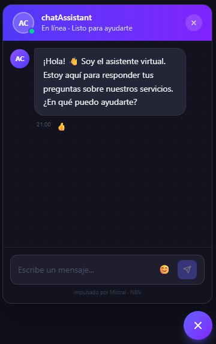
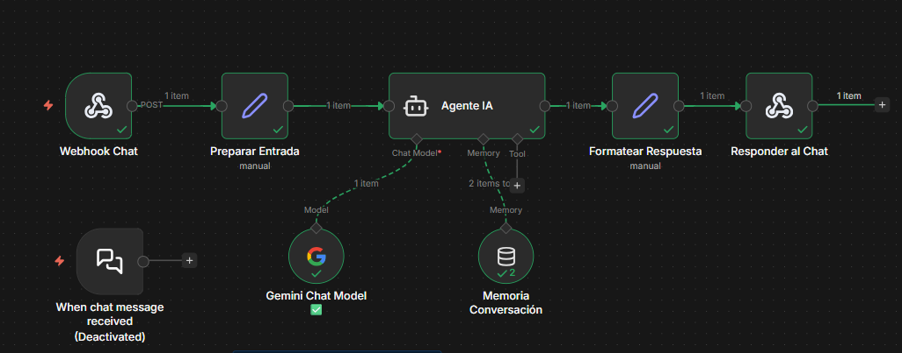

# ChatBox — Asistente IA con N8N y Gemini

> Widget de chat empresarial flotante conectado a N8N mediante webhook, con Gemini 2.5 Flash como motor de IA y memoria conversacional por sesión.



---

## Descripción

Chatbox de botón flotante (FAB) diseñado para integrar un asistente virtual en cualquier sitio web empresarial. El usuario interactúa con un widget compacto (350×500 px) que se comunica en tiempo real con un agente de IA orquestado en N8N.

El agente responde preguntas sobre la empresa usando un contexto personalizable definido en el system prompt de N8N, con memoria de conversación por sesión para mantener el hilo del diálogo.

---

## Stack tecnológico

| Tecnología | Versión | Rol |
|------------|---------|-----|
| [Next.js](https://nextjs.org) | 15 | Framework principal — App Router |
| TypeScript | 5 | Tipado estático |
| [Tailwind CSS](https://tailwindcss.com) | v4 | Estilos utilitarios |
| [GSAP](https://gsap.com) | 3 | Animaciones de entrada y widget |
| [N8N](https://n8n.io) | Cloud | Orquestación del agente IA |
| [Gemini 2.5 Flash](https://ai.google.dev) | — | Motor de lenguaje (LLM) |

---

## Flujo de arquitectura

```
Usuario → ChatWidget (Next.js)
            ↓
        /api/chat  (proxy server-side)
            ↓
        N8N Webhook  (POST /chatbox)
            ↓
        Preparar Entrada  →  Agente IA
                                ↓         ↓
                          Gemini 2.5   Memoria
                           Flash      Conversación
                                ↓
                        Formatear Respuesta
                                ↓
                        Responder al Chat  →  Usuario
```

### Flujo N8N



---

## Características del widget

- **Botón flotante (FAB)** en esquina inferior derecha, siempre visible
- **Animación slide-in** con GSAP al abrir/cerrar
- **Burbujas de mensaje** diferenciadas (usuario / asistente)
- **Indicador de escritura** (typing dots) mientras el agente procesa
- **Rating de mensajes** — botones 👍 / 👎 por respuesta
- **Emoji picker** integrado (sin SSR, carga dinámica)
- **Escucha evento personalizado** `open-chat` para abrir desde cualquier parte del sitio
- **Sin hidratación** — SSR-safe con timestamps estables

---

## Estructura del proyecto

```
chat-api-n8n-v1/
├── src/
│   ├── app/
│   │   ├── api/
│   │   │   └── chat/
│   │   │       └── route.ts       # Proxy server-side → N8N
│   │   ├── globals.css            # Design tokens + animaciones
│   │   ├── layout.tsx
│   │   └── page.tsx
│   ├── components/
│   │   ├── chat/
│   │   │   ├── ChatWidget.tsx     # Widget completo (FAB + panel)
│   │   │   ├── ChatMessage.tsx    # Bubble con rating
│   │   │   └── EmojiPicker.tsx   # Picker dinámico
│   │   └── home/
│   │       └── Hero.tsx           # Landing page con stack cards
│   ├── lib/
│   ├── types/
│   │   └── chat.ts                # Message, MessageRole, Rating
│   └── ...
├── n8n-flows/
│   ├── chatbox-asistente-ia.json  # Workflow exportado de N8N
│   └── company-context.md         # Contexto de empresa para el system prompt
├── MEJORAS-CHATBOX.md             # Hoja de ruta de mejoras (22 ítems)
└── .env.local                     # Variables de entorno (no versionado)
```

---

## Configuración

### 1. Clonar e instalar dependencias

```bash
git clone https://github.com/Verastian/chat-api-n8n-v1.git
cd chat-api-n8n-v1
npm install
```

### 2. Variables de entorno

Crea un archivo `.env.local` en la raíz del proyecto:

```env
# URL del webhook en tu instancia de N8N
N8N_WEBHOOK_URL=https://tu-instancia.n8n.cloud/webhook/chatbox
```

### 3. Importar el flujo en N8N

1. Abre tu instancia de N8N
2. Ve a **Workflows → Import from file**
3. Selecciona `n8n-flows/chatbox-asistente-ia.json`
4. Configura las credenciales de **Google Gemini (PaLM API)**
5. Edita el `systemMessage` en el nodo **Agente IA** con el contexto de tu empresa (ver `n8n-flows/company-context.md` como referencia)
6. Activa el workflow con el toggle **Active**

### 4. Levantar el servidor de desarrollo

```bash
npm run dev
```

Abre [http://localhost:3000](http://localhost:3000)

---

## Variables de entorno requeridas

| Variable | Descripción | Requerida |
|----------|-------------|-----------|
| `N8N_WEBHOOK_URL` | URL del webhook POST en N8N | ✅ Sí |

---

## N8N — Nodos del flujo

| Nodo | Tipo | Descripción |
|------|------|-------------|
| Webhook Chat | `n8n-nodes-base.webhook` | Recibe POST en `/chatbox` |
| Preparar Entrada | `n8n-nodes-base.set` | Extrae `chatInput` y `sessionId` del body |
| Agente IA | `@n8n/n8n-nodes-langchain.agent` | Agente conversacional con system prompt |
| Gemini Chat Model | `lmChatGoogleGemini` | `models/gemini-2.5-flash` |
| Memoria Conversación | `memoryBufferWindow` | Historial de 10 turnos por sesión |
| Formatear Respuesta | `n8n-nodes-base.set` | Estructura el JSON de respuesta |
| Responder al Chat | `n8n-nodes-base.respondToWebhook` | Devuelve `{ output, sessionId, model, timestamp }` |

---

## Personalización del asistente

El contexto de la empresa se define en el campo **systemMessage** del nodo **Agente IA** en N8N.

El archivo `n8n-flows/company-context.md` contiene un ejemplo completo con:
- Productos y precios
- Métodos de pago y facturación
- Información de soporte
- Políticas de reembolso
- Reglas de comportamiento del bot

Edita directamente ese campo en N8N para adaptarlo a tu empresa.

---

## Scripts disponibles

```bash
npm run dev      # Servidor de desarrollo con Turbopack
npm run build    # Build de producción
npm run start    # Servidor de producción
npm run lint     # Linter ESLint
```

---

## Hoja de ruta

Ver [`MEJORAS-CHATBOX.md`](MEJORAS-CHATBOX.md) para el listado completo de 22 mejoras planificadas organizadas por categoría:

- Funcionalidades (historial, sugerencias, Markdown, retry...)
- Seguridad (rate limiting, sanitización, headers HTTP...)
- Formularios y captura de leads
- UX y diseño (modo oscuro/claro, typewriter, avatar...)
- Rendimiento (lazy loading, caché, timeouts...)
- Accesibilidad (WCAG AA, teclado, aria-live...)
- Analítica y monitoreo

---

## Licencia

MIT
